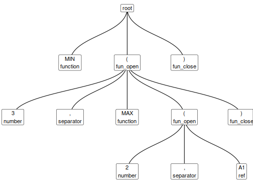

<!-- README.md is generated from README.Rmd. Please edit that file -->
lexl
====

[](https://travis-ci.org/nacnudus/lexl) [](https://ci.appveyor.com/project/nacnudus/lexl) [](https://cran.r-project.org/package=lexl) [](https://www.r-pkg.org/pkg/lexl) [](https://codecov.io/github/nacnudus/lexl?branch=master)

[lexl](https://github.com/nacnudus/lexl) separates Excel formulas into tokens of different types, and gives their depth within a nested formula. Its name is a bad pun on 'Excel' and 'lexer'. Try the [online demo](https://duncan-garmonsway.shinyapps.io/lexl/) or run `demo_lexl()` locally.

Installation
------------

You can install lexl from github with:

``` r
# install.packages("devtools")
devtools::install_github("nacnudus/lexl")
```

Example
-------

``` r
library(lexl)
x <- lex_xl("MIN(3,MAX(2,A1))")
x
#>    level      type token
#> 1      0  function   MIN
#> 2      0  fun_open     (
#> 3      1    number     3
#> 4      1 separator     ,
#> 5      1  function   MAX
#> 6      1  fun_open     (
#> 7      2    number     2
#> 8      2 separator     ,
#> 9      2       ref    A1
#> 10     1 fun_close     )
#> 11     0 fun_close     )

plot(x) # Requires the ggraph package
```



Parse tree
----------

Not all parse trees are the same. The one given by `lex_xl()` is intended for analysis, rather than for computation. Examples of the kind of analysis that it might support are:

-   Detecting constants that have been embedded inside formulas, rather than in cells referred to by formulas.
-   Revealing which functions and combinations of functions are most common.
-   Untangling the dependencies between cells in a spreadsheet.

Where to find specimen formulas
-------------------------------

The [tidyxl](https://nacnudus.github.io/tidyxl) package imports formulas from xlsx (spreadsheet) files.

The [Enron corpus](https://figshare.com/articles/Enron_Spreadsheets_and_Emails/1221767) contains thousands of real-life spreadsheets.

Inspiration
-----------

[Research](https://drive.google.com/file/d/0B79P2Uym3JjvMjlaWWtnTWRLQmc/view?usp=sharing) by Felienne Hermans inspired this package, and the related [XLParser](https://github.com/spreadsheetlab/XLParser) project was a great help in creating the grammar.
